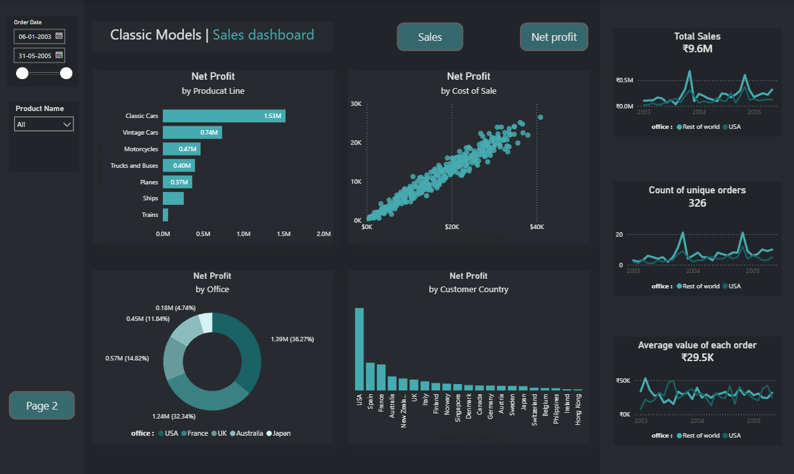
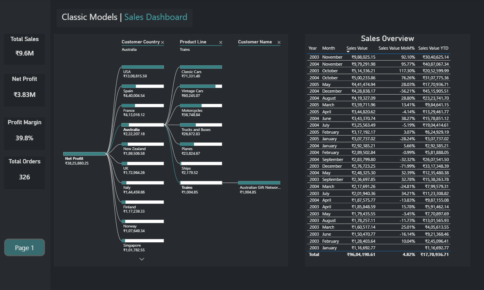

# 📊 Sales Analytics Dashboard

## Overview

This project is an interactive **Sales Analytics Dashboard** built in **Power BI** using the Classic Models dataset. The dashboard provides insights into sales performance, profitability, customer behavior, and product line performance through interactive visualizations and KPI tracking.

---

## Dashboard Objectives

* Monitor overall business performance
* Analyze sales and profitability trends
* Identify top-performing product lines
* Evaluate customer and country-level profitability
* Track key business KPIs
* Perform root-cause analysis using a decomposition tree

---

## Key Features

### Page 1: Sales Overview Dashboard

* Total Sales KPI
* Total Orders KPI
* Average Order Value KPI
* Product Line Profitability Analysis
* Customer Country Profit Analysis
* Office-wise Profit Distribution
* Cost of Sales vs Net Profit Analysis
* Interactive Filters for Date and Product Selection

### Page 2: Profit Analysis Dashboard

* Net Profit KPI
* Profit Margin KPI
* Total Orders KPI
* Decomposition Tree Analysis
* Sales Performance Overview Table
* Customer, Product Line, and Country Drill-down Analysis

---

## KPIs Tracked

| KPI           | Value  |
| ------------- | ------ |
| Total Sales   | ₹9.6M  |
| Net Profit    | ₹3.83M |
| Profit Margin | 39.8%  |
| Total Orders  | 326    |

---

## Business Insights

* Classic Cars generated the highest profit among all product lines.
* USA contributed the largest share of overall profitability.
* Profitability varies significantly across customer countries.
* The decomposition tree helps identify key drivers of business performance.

---

## Tools & Technologies

* Power BI
* Power Query
* DAX (Data Analysis Expressions)
* Data Modeling
* Data Visualization

---

## Dashboard Preview

### Sales Overview Dashboard

### Profit Analysis Dashboard

---

## Project Files

* `Sales_Analytics.pbix`
* `Sales_Overview_Dashboard.png`
* `Profit_Analysis_Dashboard.png`

---

## Skills Demonstrated

* Data Cleaning & Transformation
* Data Modeling
* DAX Calculations
* KPI Design
* Dashboard Development
* Business Intelligence Reporting
* Data Visualization
* Analytical Thinking

---

## Author

**Atharva Keluskar**
